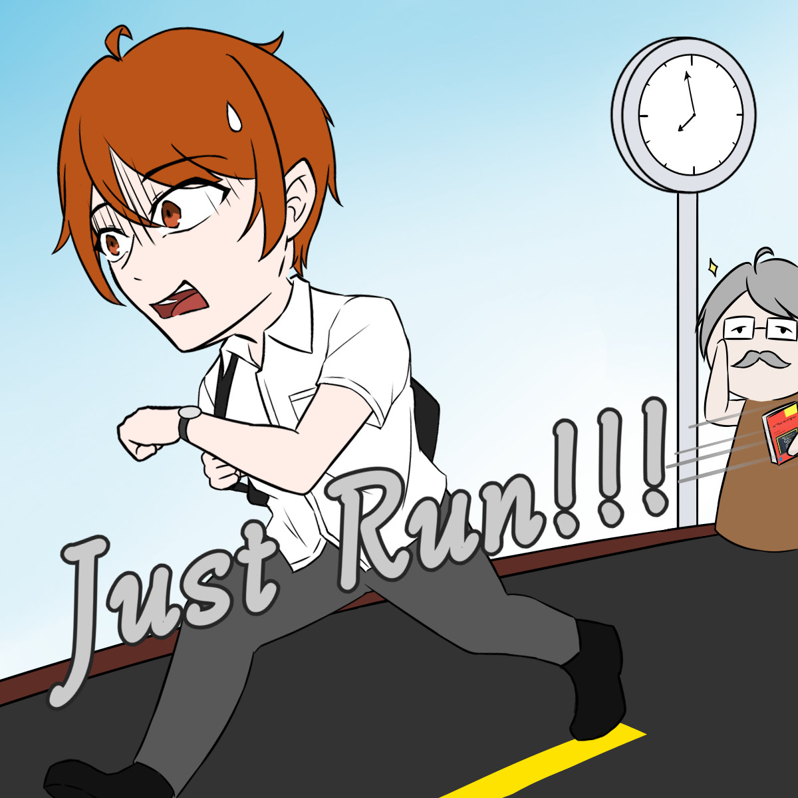
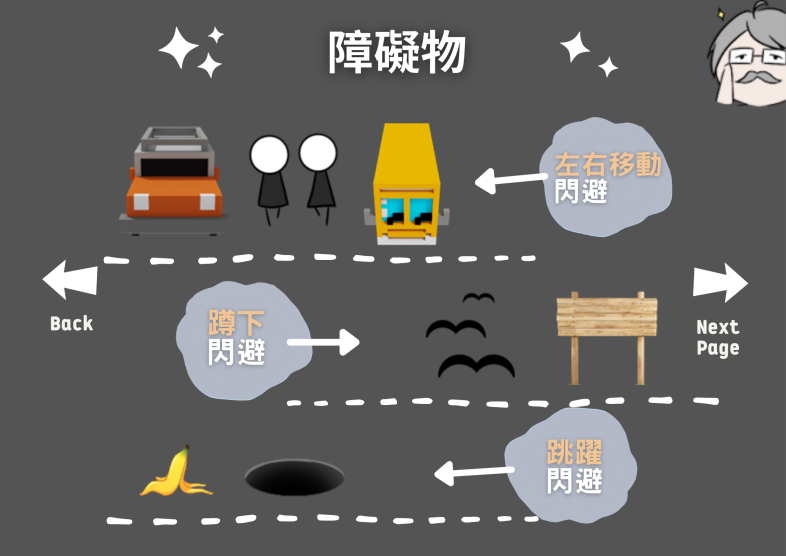
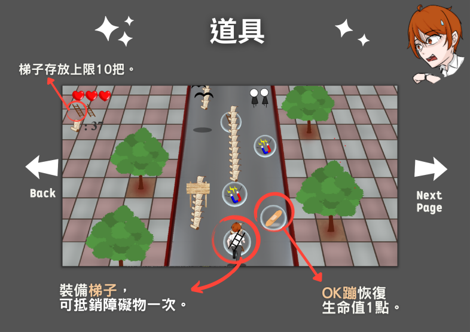
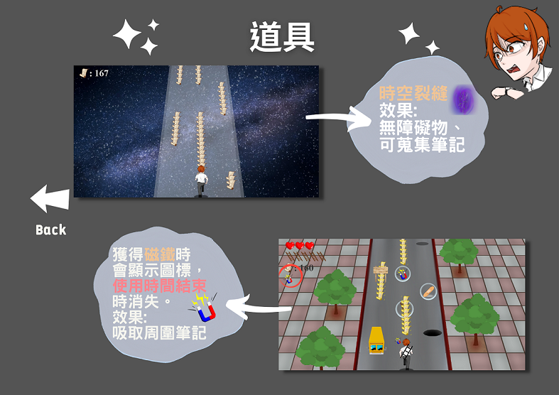
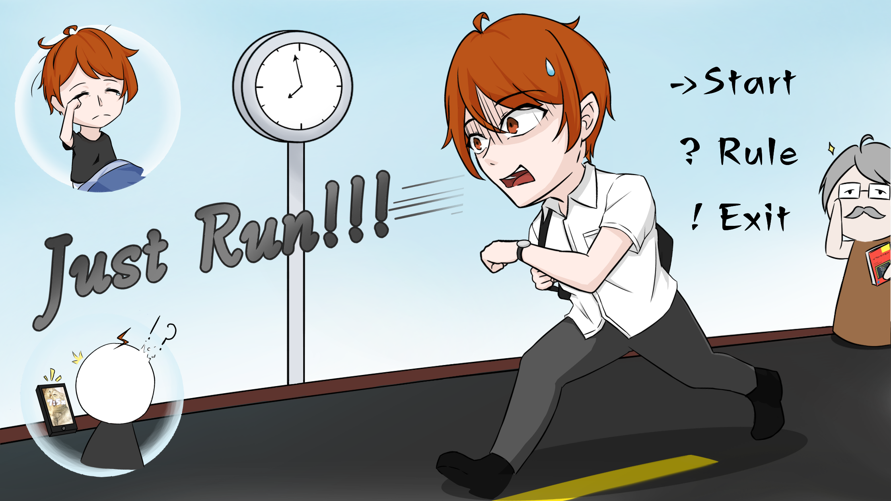
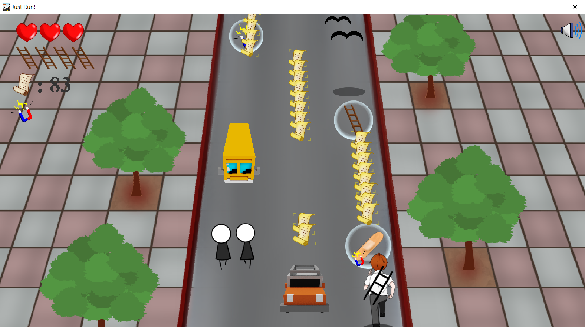
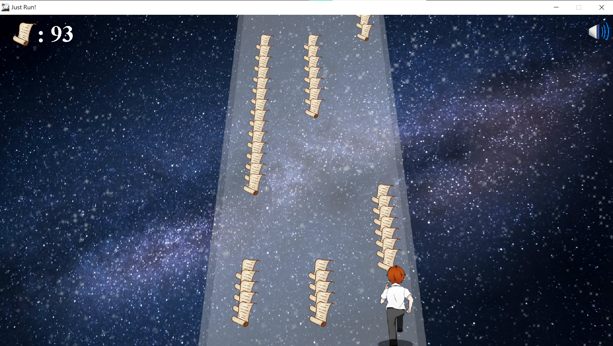
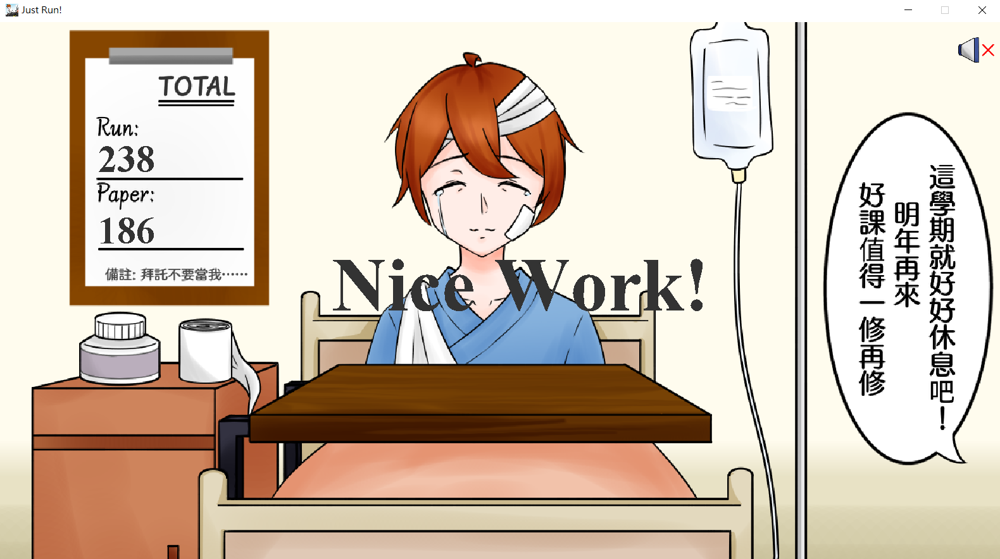
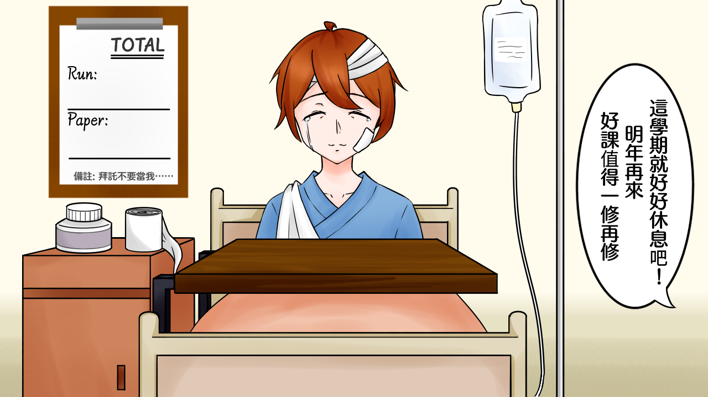

# Just-Run

## 一、遊戲介紹
遊戲主題源自「Subway Surfer」，以Java程式語言實作，透過GUI呈現。

進入遊戲畫面，玩家會作為學生的角色在道路上奔馳，奔跑速度根據跑的時間逐漸加快，途中玩家須閃躲障礙物，道路上也會有許多道具供玩家拿取，可以獲得增益效果，有更換場景之道具，也有做為恢復生命值的道具，當生命值歸零時遊戲結束。遊戲分數計算依據奔跑距離和蒐集到的筆記(Paper)數量，筆記的數量象徵學生的知識量。
## 二、遊戲安裝步驟
1. 確認電腦有無下載 Java。
2. 開啟Window輸入 cmd 進入命令提示字元。
3. 進入下載好的Just-Run資料夾路徑。
     > cd xxx/xxx/Just-Run
4. 輸入以下指令進行程式安裝編譯。
     > javac *.java
5. 輸入 java Group14_Game進行遊戲。
     > java Group14_Game
## 三、遊戲規則
1. 遊戲起始畫面可選擇開始遊戲或查看規則說明。
2. 遊戲途中可透過道具獲取增益效果。
3. 玩家進行一次遊戲有三條生命，撞到一次障礙物會扣取一條生命。
4. 玩家必須依照對應方式閃避障礙物(跳躍、蹲下、左右閃避)。
5. 若生命值為 0 則遊戲結束。
6. 分數依據過程中蒐集的筆記與奔跑的距離計算。
7. 畫面右上角可開啟/關閉遊戲音效。
*  遊戲操作方式
   *  以鍵盤操控玩家，使用方向鍵移動角色，左右鍵轉換跑道，上鍵跳躍，下鍵蹲下。
   *  使用 Shift 鍵裝備梯子，使用效果。
*  道具(Items)
   *  筆記(paper)-遊戲分數計算依據，蒐集越多筆記分數越高。
   *  磁鐵(magnet)-在一定時間內可吸取周圍筆記的道具。
   *  OK 蹦(bandaid)-恢復玩家一條生命。
   *  時空裂縫(rift)-更換場景，掉到另外一個沒有障礙物的空間，可賺取大量筆記的地方。
   *  梯子(ladder)-裝備梯子後可迴避障礙物一次(無敵狀態)。一開始玩家預設為 3 把梯子，沿途可蒐集增加，上限 10 把。

## 四、遊戲畫面
### 起始畫面

### 遊戲途中畫面

### 遊戲結束畫面

